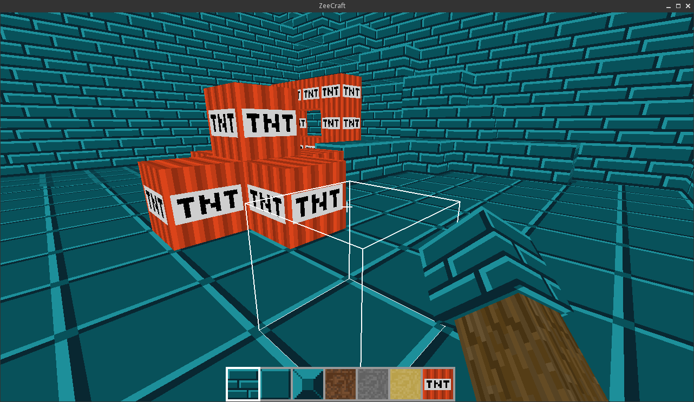
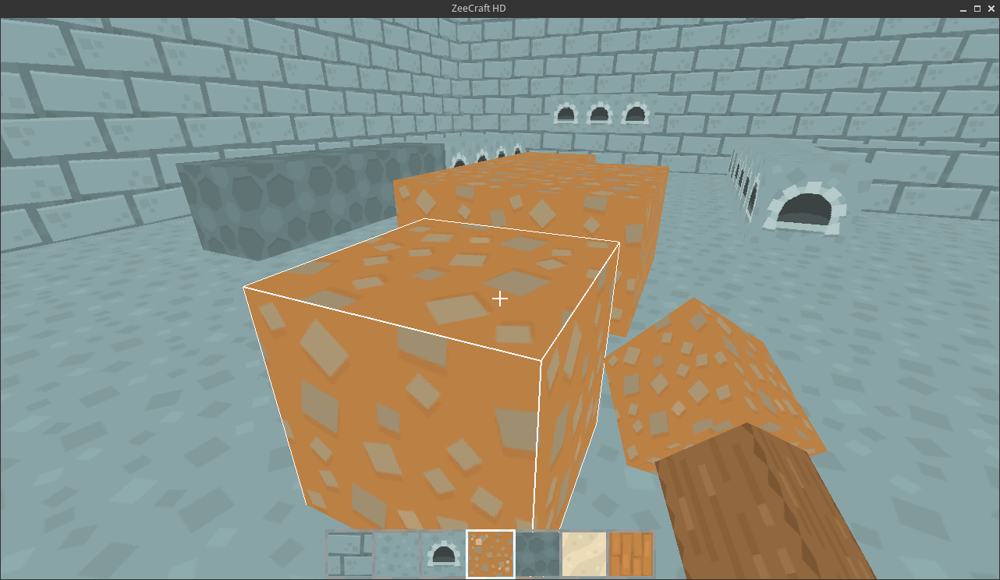

ZeeCraft
========
ZeeCraft is a _mini_ Minecraft clone in 588 lines of C.

Originally I intended to keep it at 500 or below, but it felt
bad to remove certain features like *automatic load/save*.



### HD



_No voxels have been harmed during the making of ZeeCraft._

**WARNING: This is not production quality code and should not be
used or considered as such under any condition. Consider yourself
warned.**

Dependencies
------------
* premake4
* SDL2
* OpenGL 1.4+ (fixed function pipeline)

Getting Started
---------------

```bash
premake4 gmake
make -C build
```

Or the *HD* version:

```bash
premake4 --with-hd-textures gmake
make -C build
```

To run it, just type:

```bash
build/zc
```

Credits
-------
Special thanks to [Kenney "Asset" Jesus](kenney.nl) for *HD* textures.

Contribute
----------
* Fork the project.
* Make your feature addition or bug fix.
* Do **not** bump the version number.
* Send me a pull request. Bonus points for topic branches.

License
-------
Copyright (c) 2016, Mihail Szabolcs

ZeeCraft is provided **as-is** under the **MIT** license.
For more information see LICENSE.
